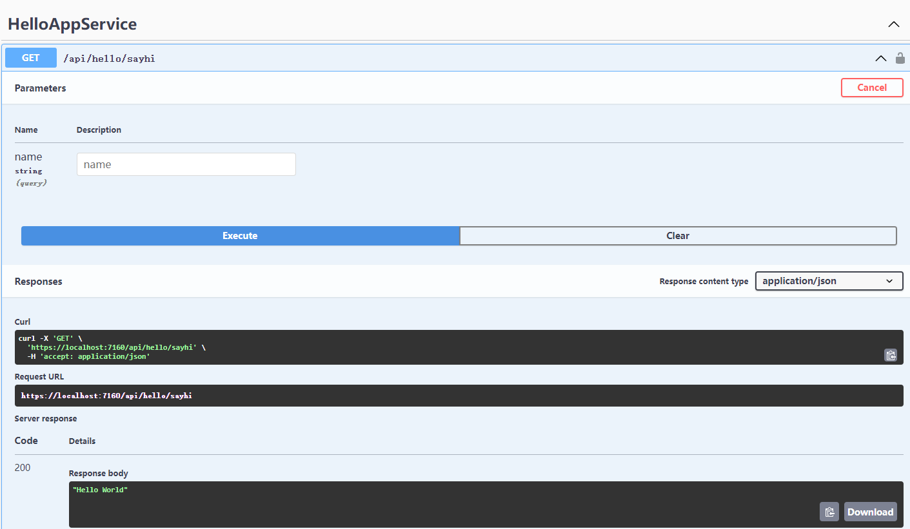

<p align="center">
  
</p>

# Silky 微服务框架
[](./LICENSE)
[](https://img.shields.io/github/last-commit/liuhll/silky)
[](https://www.nuget.org/packages/Silky.Core)
[](https://www.myget.org/feed/Packages/silky-preview)
[](https://www.nuget.org/packages/Silky.Core)
[](https://space.bilibili.com/354560671/channel/seriesdetail?sid=2797330)
[](https://hits.seeyoufarm.com)

<div align="center">

**简体中文 | [English](./README.en-US.md)**

</div>

## 项目介绍


silky框架旨在帮助开发者在.net平台下,通过简单代码和配置快速构建一个微服务应用的开发框架。它提供了 **RPC通信** 与 **微服务治理** 两大关键能力。这意味着，使用 silky 开发的微服务，将具备相互之间的远程发现与通信能力， 同时利用 silky 提供的丰富服务治理能力，可以实现诸如服务发现、负载均衡、流量调度等服务治理诉求。同时 silky 是高度可扩展的，用户几乎可以在任意功能点去定制自己的实现，以改变框架的默认行为来满足自己的业务需求。

silky微服务有着如下的优势：
- 开箱即用
  - 简单易用,使用[通用主机](https://docs.microsoft.com/zh-cn/aspnet/core/fundamentals/host/generic-host?view=aspnetcore-5.0)或是[web主机](https://docs.microsoft.com/zh-cn/aspnet/core/fundamentals/host/web-host?view=aspnetcore-5.0)来构建(托管)微服务应用。
  - 易用性高，面向接口代理特性能实现本地透明调用。
  - 功能丰富，基于原生库或轻量扩展即可实现绝大多数的微服务治理能力。

- 超大规模微服务集群实践
  - 高性能的跨进程通信协议,使用[DotNetty](https://github.com/Azure/DotNetty)通信框架实现了基于接口代理的RPC框架，提供高性能的基于代理的远程调用能力，服务以接口为粒度，为开发者屏蔽远程调用底层细节。
  - 地址发现、流量治理层面，轻松支持规模化集群实例。

- 企业级微服务治理能力
  - 通过[Polly](https://github.com/App-vNext/Polly)实现的服务治理,提高服务的容错能力。
  - 内置多种负载均衡策略，智能感知下游节点健康状况，显著减少调用延迟，提高系统吞吐量。
  - 支持多种注册中心服务,服务实例上下线实时感知。

- 数据一致性的保证
  - 使用TCC分布式事务保证数据最终一致性。

## 框架特性


### 服务引擎

- 负责silky主机的初始化过程
- 负责模块解析、依赖管理与加载
- 服务注册与解析

### 模块化/插件化设计
- 模块与模块之间具有依赖关系
- 支持插件化加载模块
- 支持插件化加载应用服务

### RPC通信

- 使用[Dotnetty](https://github.com/Azure/DotNetty)作为底层通信组件，使用TCP作为通信协议, 采用长链接方式提高系统吞吐量
- 基于接口的动态代理
- 支持通过模板调用
- 支持JSON编解码方式
- RPC通信过程中支持缓存拦截,提高通信性能
- RPC调用监控

### 服务治理

- 服务自动注册和发现,服务实例上下线智能感知
- RPC调用失败重试
- 支持轮询、随机路由、哈希一致性等负载均衡路由方式, 智能感知下游节点健康状况，显著减少调用延迟，提高系统吞吐量。
- 支持HTTP限流和RPC调用限流
- 支持熔断保护,当发生非友好类异常n次后开启熔断保护
- 支持RPC调用的监视
- 服务降级,当RPC调用失败后调用`Fabllback`指定的方法达到服务容错的目的
- 通过配置支持禁止服务被外部访问

### 通过.net主机构建

- 使用web主机构建微服务应用
- 使用通用主机构建微服务应用
- 构建具有websocket能力的微服务应用
- 构建网关应用
  

### 安全设计

- 网关统一进行身份认证与鉴权
- rpc token用于保护RPC通信,保证外部无法直接访问rpc服务
- RPC通信支持ssl加密

### 多种配置方式

- 支持Json格式配置文件
- 支持Yaml格式配置文件
- 支持Apollo作为配置服务中心
- 使用环境变量

### 链路跟踪

- HTTP请求
- RPC调用
- TCC分布式事务
- 其他(EFCore)...

### 支持分布式事务

- RPC通信过程中,通过TCC分布式框架保证数据最终一致性
- 使用拦截器+TODO日志实现
- 使用 Redis作为TODO日志存储仓库

### 支持websocket通信

- 通过[websocketsharp.core](https://www.nuget.org/packages/websocketsharp.core/)组件构建websocket服务
- 透过网关代理与前端进行握手、会话

## 入门

- 通过[开发者文档](http://docs.silky-fk.com/silky/)学习Silky框架;
- 通过[silky.samples项目](http://docs.silky-fk.com/silky/dev-docs/quick-start.html)熟悉如何使用Silky框架构建一个微服务应用;
- 通过[配置](http://docs.silky-fk.com/config/)文档熟悉Silky框架的相关配置属性;
- 通过B站[silky框架教学](https://space.bilibili.com/354560671/channel/seriesdetail?sid=2797330)学习;

## 示例项目

### Silky.Hero权限管理系统

* 项目地址
https://github.com/liuhll/silky.hero

* 演示地址
https://hero.silky-fk.com/

* 账号信息(租户silky)
  * 管理员账号(密码): admin(123qweR!)
  * 普通用户: liuhll(123qweR!)
  * 其他账号密码: 123qweR!


## 快速开始

### 基础服务

推荐使用`docker-compose`安装部署基础服务.

1. 安装部署Zookeeper,将[docker-compose.zookeeper.yml](https://raw.githubusercontent.com/liuhll/silky/main/framework/test/docker-compose/infrastr/docker-compose.zookeeper.yml)拷贝并保持到本地,然后通过如下命令安装Zookeeper服务:

```shell
docker-compose -f docker-compose.zookeeper.ym up -d
```

2. 安装部署redis缓存服务, 将[docker-compose.redis.yml](https://raw.githubusercontent.com/liuhll/silky/main/framework/test/docker-compose/infrastr/docker-compose.redis.yml)拷贝并保持到本地,然后通过如下命令安装redis服务:

```shell
docker-compose -f docker-compose.redis.ym up -d
```

### 创建网关

1. 创建一个**空的WebApplication**项目命名为**Gateway**,安装`Silky.Agent.Host`包,并在`Program.cs`类中新增创建托管网关应用主机的代码;

```csharp
using Gateway;

var hostBuilder = Host.CreateDefaultBuilder()
    .ConfigureSilkyGatewayDefaults(webHostBuilder => webHostBuilder.UseStartup<Startup>());
await hostBuilder.Build().RunAsync();

```

2. 新增`Startup.cs`类,并添加如下代码;

```csharp
namespace Gateway;

public class Startup
{
    public void ConfigureService(IServiceCollection services)
    {
        services.AddSilkyHttpServices()
            .AddRouting()
            .AddSwaggerDocuments()
            .AddMiniProfiler();
    }

    public void Configure(IApplicationBuilder app, IWebHostEnvironment env)
    {
        if (env.IsDevelopment())
        {
            app.UseSwaggerDocuments();
            app.UseMiniProfiler();
        }

        app.UseRouting();
        app.UseEndpoints(endpoints => { endpoints.MapSilkyRpcServices(); });
    }
}
```

3. 删除`.json`的配置文件,并新增`appsetiings.yaml`配置文件，并添加如下配置:

```yaml
rpc:
  token: ypjdYOzNd4FwENJiEARMLWwK0v7QUHPW
 
registrycenter:
  type: Zookeeper
  connectionStrings: 127.0.0.1:2181,127.0.0.1:2182,127.0.0.1:2183;127.0.0.1:2184,127.0.0.1:2185,127.0.0.1:2186
distributedCache:
  redis:
    isEnabled: true
    configuration: 127.0.0.1:6379,defaultDatabase=0
```

4. 运行网关项目,查看http服务运行的地址(如: http端口为5000),那么通过浏览器打开*https://127.0.0.1:5001/index.html* swagger在线文档;在没有通过业务微服务添加啊啊应用服务的时候,swagger文档并不存在任何接口:


### 业务微服务

1. 创建一个名为**DemoHost**控制台项目,安装`Silky.Agent.Host`包,并在`Program.cs`类中新增创建托管应用主机的代码;

```csharp
using Microsoft.Extensions.Hosting;

var hostBuilder = Host.CreateDefaultBuilder().ConfigureSilkyGeneralHostDefaults();
await hostBuilder.Build().RunAsync();                      
```

2. 新增`appsettings.yaml`配置文件，并添加如下配置:

```yaml
rpc:
  token: ypjdYOzNd4FwENJiEARMLWwK0v7QUHPW
  port: 2200
 
registrycenter:
  type: Zookeeper
  connectionStrings: 127.0.0.1:2181,127.0.0.1:2182,127.0.0.1:2183;127.0.0.1:2184,127.0.0.1:2185,127.0.0.1:2186

distributedCache:
  redis:
    isEnabled: true
    configuration: 127.0.0.1:6379,defaultDatabase=0
```

3. 添加一个示例服务，新增文件夹**Hello**,并添加`IHellAppService`接口:

```csharp
[ServiceRoute]
public interface IHelloAppService
{
    Task<string> SayHi([FromQuery]string name);
}
```

4. 添加`HellAppService`类,并实现`IHellAppService`接口:

```csharp
public class HelloAppService : IHelloAppService
{
    public Task<string> SayHi(string name)
    {
        return Task.FromResult($"Hello {name ?? "World"}");
    }
}
```

5. 运行**DemoHost**项目,并通过浏览器刷新Swagger在线文档,即可看到如下接口,通过swagger文档可以在线调试webapi:



## 服务与服务之间的调用方式

1. 通过引用其他微服务应用的应用接口类库(其他微服务可以将应用接口打包成nuget包后,通过nuget包安装其他微服务应用的应用接口的nuget包),通过构造注入的接口的方式,直接使用接口所定义的方法，即可通过接口生成的动态代理与服务提供者实现RPC通信:

例如: 在[Silky.Hero](https://github.com/liuhll/silky.hero)项目中的权限管理器[PermissionManager.cs](https://github.com/liuhll/silky.hero/blob/main/services/Silky.Permission/src/Silky.Permission.Domain/Permission/PermissionManager.cs)

```csharp
public class PermissionManager : IPermissionManager, IScopedDependency
{
    private readonly IUserAppService _userAppService;
    private readonly IRoleAppService _roleAppService;

    public PermissionManager(IUserAppService userAppService,
        IRoleAppService roleAppService)
    {
        _userAppService = userAppService;
        _roleAppService = roleAppService;
    }

    public async Task<ICollection<string>> GetUserRoleNamesAsync(long userId)
    {
        var userRoleOutput = await _userAppService.GetRolesAsync(userId);
        return userRoleOutput.RoleNames;
    }

    public async Task<ICollection<long>> GetUserRoleIdsAsync(long userId)
    {
        var userRoleIds = await _userAppService.GetRoleIdsAsync(userId);
        return userRoleIds;
    }

    public async Task<ICollection<string>> GetRolePermissionsAsync(long roleId)
    {
        var rolePermissions = await _roleAppService.GetPermissionsAsync(roleId);
        return rolePermissions;
    }
}
```

2. 通过模板调用接口`IInvokeTemplate`提供的API,实现远程服务调用,该接口支持通过服务条目Id或是WebAPI的方式路由到具体的服务提供者方法;

例如: 在[Silky.Hero](https://github.com/liuhll/silky.hero)项目中,网关的权限认证处理器[AuthorizationHandler](https://github.com/liuhll/silky.hero/blob/main/services/Silky.Gateway/src/Silky.GatewayHost/Authorization/AuthorizationHandler.cs)通过`IInvokeTemplate`调用权限应用服务提供的权限服务判断当前请求的接口是否有访问权限:

```csharp

public class AuthorizationHandler : SilkyAuthorizationHandlerBase
{
    private readonly IInvokeTemplate _invokeTemplate;

    private const string CheckPermissionServiceEntryId =
        "Silky.Permission.Application.Contracts.Permission.IPermissionAppService.CheckPermissionAsync.permissionName_Get";

    private const string CheckRoleServiceEntryId =
        "Silky.Permission.Application.Contracts.Permission.IPermissionAppService.CheckRoleAsync.roleName_Get";

    public AuthorizationHandler(IInvokeTemplate invokeTemplate)
    {
        _invokeTemplate = invokeTemplate;
    }

    protected override async Task<bool> PolicyPipelineAsync(AuthorizationHandlerContext context,
        HttpContext httpContext,
        IAuthorizationRequirement requirement)
    {
        if (requirement is PermissionRequirement permissionRequirement)
        {
            if (EngineContext.Current.HostEnvironment.EnvironmentName == SilkyHeroConsts.DemoEnvironment &&
                httpContext.Request.Method != "GET")
            {
                throw new UserFriendlyException("演示环境不允许修改数据");
            }

            var serviceEntryDescriptor = httpContext.GetServiceEntryDescriptor();
            if (serviceEntryDescriptor.GetMetadata<bool>("IsSilkyAppService"))
            {
                // todo 
                return true;
            }

            return await _invokeTemplate.InvokeForObjectByServiceEntryId<bool>(CheckPermissionServiceEntryId,
                permissionRequirement.PermissionName);
        }

        return true;
    }

    protected override async Task<bool> PipelineAsync(AuthorizationHandlerContext context, HttpContext httpContext)
    {
        var serviceEntryDescriptor = httpContext.GetServiceEntryDescriptor();
        var roles = serviceEntryDescriptor
            .AuthorizeData
            .Where(p => !p.Roles.IsNullOrEmpty())
            .SelectMany(p => p.Roles?.Split(","))
            .ToList();
        foreach (var role in roles)
        {
            if (!await _invokeTemplate.InvokeForObjectByServiceEntryId<bool>(CheckRoleServiceEntryId, role))
            {
                return false;
            }
        }

        return true;
    }
}
```

> 备注:
>
> 使用模板调用的方式优势在于微服务应用与应用之间不用引用其他微服务应用定义的应用接口,应用与应用完全解耦,互相不依赖；缺点在于并不支持分布式事务的使用场景;

## 通过项目模板快速创建应用

silky提供了模板`silky.app`模板可以快速的创建应用，开发者可以在安装模板后使用模块快速创建silky微服务应用。

```pwsh

> dotnet new --install Silky.App.Template
```

使用项目模板创建微服务应用。

```pwsh

PS> dotnet new silky.app -h
Silky App (C#)
作者: Liuhll

Usage:
  dotnet new silky.app [options] [模板选项]

Options:
  -n, --name <name>       正在创建的输出名称。如未指定名称，则使用输出目录的名称。
  -o, --output <output>   要放置生成的输出的位置。
  --dry-run               如果运行给定命令行将导致模板创建，则显示将发生情况的摘要。
  --force                 强制生成内容 (即使它会更改现有文件)。
  --no-update-check       在实例化模板时，禁用对模板包更新的检查。
  --project <project>     应用于上下文评估的项目。
  -lang, --language <C#>  指定要实例化的模板语言。
  --type <project>        指定要实例化的模板类型。

模板选项:
  -t, --param:type <param:type>  Set the silky host type, optional values: webhost, generalhost ,wshost, gateway
                                 类型: string
                                 默认: generalhost
  -do, --dockersupport           Add docker support for Silky
                                 类型: bool
                                 默认: true
  -r, --rpcport <rpcport>        Set the port for rpc listening
                                 类型: int
                                 默认: 2200
  -in, --infrastr                only include basic service orchestration files
                                 类型: bool
                                 默认: false
  -e, --env <env>                Set dotnet env
                                 类型: string
                                 默认: Development
  -m, --module                   Is it a module project
                                 类型: bool
                                 默认: false
  -p:i, --includeinfr            Whether to include the basic orchestration service.
                                 类型: bool
```

示例:

```pwsh

# 创建网关
> dotnet new silky.app -t gateway -n Silky.Gateway

# 创建业务微服务
> dotnet new silky.app -t generalhost -n Silky.Demo
```

## 贡献
- 贡献的最简单的方法之一就是讨论问题（issue）。你也可以通过提交的 Pull Request 代码变更作出贡献。
